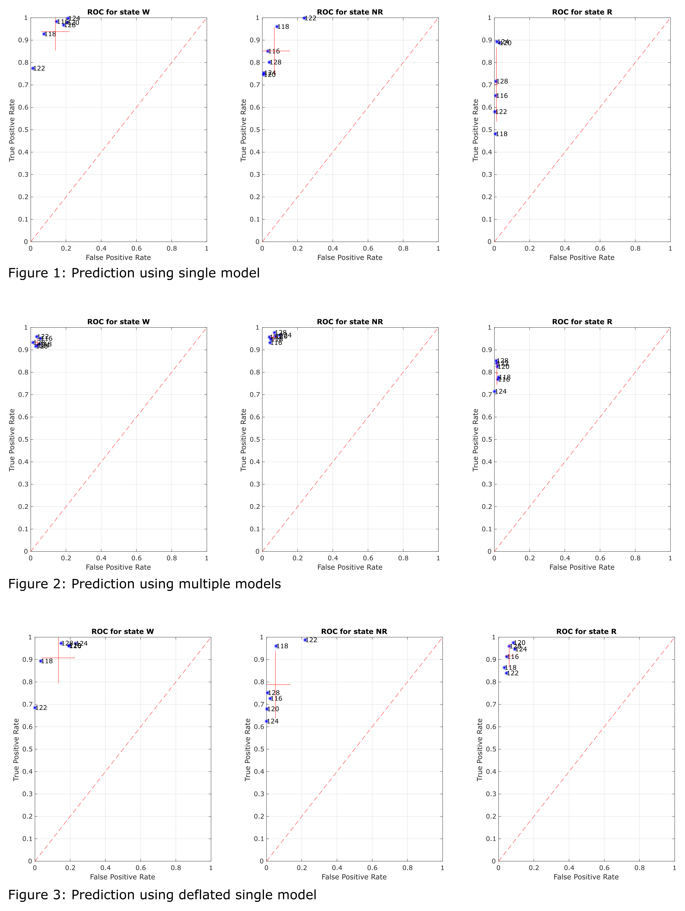
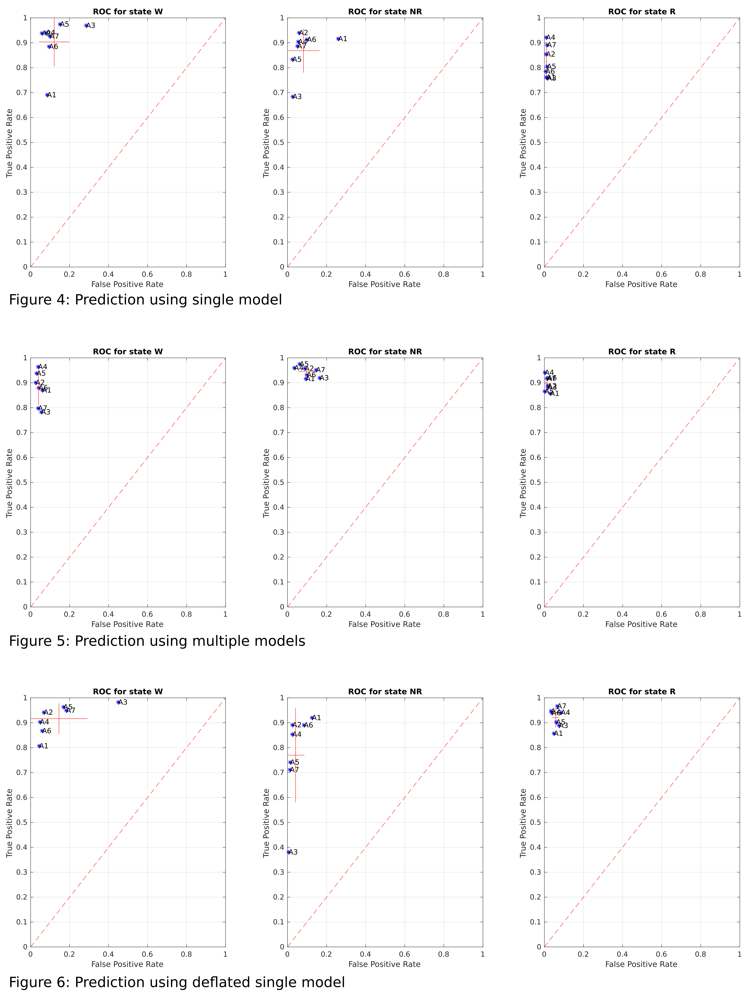

# Code to Test *k*NNSS on Your System

## Outline
The short example stored in this directory guides you through typical steps of sleep stage scoring. There are two independent datasets you can work on, one was recorded in transgenic mice, the other in control rats (see Readme in the Example_Data folder for further information on the data).

- To begin, please edit the `par.ROOTDIR` variable in setup.m file to specify the folder in which *k*NNSS is placed. setup.m will set all other path to data and functions.

- Using our supervised classification method the first step to take is the calculation of features that will describe each epoch (time window) of the recording. The FirstStep.m script will do this. Also, features are combined with manual scores to form a training set. Manual scores in this example are simplified and some labels are merged. Once features are calculated they are saved in files since their calculation might be quite time consuming in case of many and long recordings. The calculated features (plus manual scores) are partitioned into a training and a test set. The former will be used to label feature space of a *k*NN classifier, while the latter will serve to test reliability of prediction.

- Model fitting takes place in SecondStep.m. This script fits (and stores in Matlab files) two types of models. On one hand, when using the  `train_one_model` function, data from all mice are combined into a single training set and used to train the classifier. On the other hand, `train_many_models` labels one separate classifier for each animal. These models use data in the training set created during the previous step.

- Prediction of the unseen part of the data (the test set) happens in ThirdStep.m. Both types of models are tested: the single model is used to consecutively predict data from all animals, and subsequently data from each animal is predicted by its dedicated classifier as well. Since rapid eye movement (REM) sleep epochs are very scarce in the last step the single model is "deflated" by removing a number or non-REM sleep epochs. Successful testing of the software will output three named figures similar to the ones below (since feature selection has a random part to it, results might slightly vary). For the transgenic mouse data the prediction accuracy turns out as shown in Figs 1-3.

For the rat data please see Figs 4-6 below for performance.

